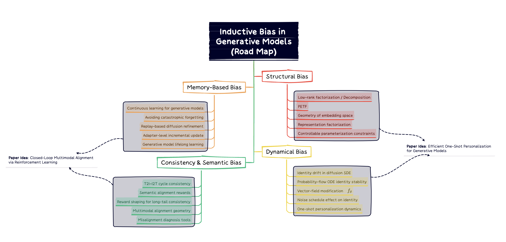

# 🏫 CHANGLONG JIN — AI Integrated Master–Ph.D. 

I am an Integrated Master–Ph.D. student in Artificial Intelligence at Yonsei University.  
My research focuses on making generative models **more stable, faithful, and self-correcting**, with a particular emphasis on diffusion models and multimodal alignment.

Research Interests:
- **Dynamics-aware Diffusion Models**
- **Closed-loop Multimodal Alignment**
- **PEFT & AST**
- **Inductive Bias**

Overall, my goal is to design generative systems that not only produce high-quality images, but also **know when they are wrong and learn how to fix themselves.**

---

# 🎯 Research Focus

- **Understanding and shaping inductive biases** that gshape identity and semantic representations and influence their stability during diffusion. [part I]

- **Modeling personalization as a perturbation to diffusion dynamics**, identifying unstable or drift-prone directions, and designing mechanisms for identity-stable sampling. [part I]

- **Building closed-loop multimodal alignment systems** where text–image models use semantic feedback to evaluate and refine their own outputs. [part II]

---

# 🔬 Unified Research Agenda  
## **Toward Faithful & Self-Improving Generative Models**

This agenda contains **two complementary research directions** that together aim to enhance the consistency, controllability, and semantic reliability of diffusion-based generative models.

---

# 🔷 Part I — Identity-Preserving Diffusion Dynamics

One-shot personalization frequently suffers from *identity drift*, where the generated subject gradually deviates from the reference.  
This issue persists across architectures—including U-Net, SDXL, and DiT—suggesting that identity loss originates from **diffusion dynamics**, not model capacity.

My research investigates how identity information propagates through the diffusion SDE/ODE process and how to stabilize it.

---

## 1. Identity Flow Analysis Through Diffusion Timesteps

I decode intermediate diffusion states (latents `x_t`) and compute identity embeddings using CLIP/DINO, then track an identity similarity curve, e.g.:

- `s_t = cos(z_t, z_ref)` where `z_t` is the embedding at timestep `t`  
- visualize how similarity changes across timesteps  
- identify critical intervals where identity degradation emerges  
- compare DDPM / DDIM / flow-matching style samplers  
- analyze how noise schedule and timestep parameterization affect identity sensitivity  

This produces a systematic **identity evolution profile** for diffusion models.

---

## 2. Effects of Low-Rank Personalization on Identity Stability

Low-rank adaptation (LoRA) modifies the score function and internal representations.  
I study questions such as:

- Which layers help identity retention, and which tend to induce drift?  
- How do rank, scale, and insertion location affect identity stability?  
- Do LoRA update directions align with identity-preserving or identity-destroying subspaces in the feature space?  

Using gradient analysis and embedding-space perturbation, I aim to reveal the **structure–identity relationship** inside diffusion models.

---

## 3. Designing Identity-Stable Diffusion Dynamics

The goal is to build diffusion mechanisms that *naturally* preserve identity:

- identity-corrective vector fields added to the probability-flow ODE  
- projection onto identity-consistent subspaces of the score field  
- sampling-time regularization to stabilize sensitive regions  
- architecture-agnostic controls applicable to U-Net, SDXL, and DiT variants  

**Goal:**  
A theoretically grounded framework for *identity-stable personalization*, even in one-shot settings.

---

# 🔶 Part II — Closed-Loop Multimodal Alignment

Despite high visual quality, diffusion-based text-to-image models often fail to maintain semantic fidelity.  
They lack mechanisms to **evaluate, diagnose, and refine** their own outputs.

I aim to build a closed-loop T2I ↔ I2T refinement system where models learn to self-correct using multimodal feedback.

---

## 1. Multimodal Feedback Modeling

I design a unified reward integrating multiple semantic signals:

- **CLIP similarity** between text and image (global alignment)  
- **caption-based similarity** using an image-to-text model (`ŷ = I2T(x)`) and a text encoder `E(·)`  
- optionally, **perceptual or feature-level consistency** for stability  

A conceptual reward could be written as:

- `R(x, y) = α * CLIP(x, y) + β * cos(E(ŷ), E(y)) + γ * Perceptual(x)`

This creates a richer supervisory signal than CLIP alone and can be used to rank, filter, or refine generations.

---

## 2. Closed-Loop Generation and Refinement

Instead of full RL training, I explore lightweight iterative refinement driven by differentiable feedback.  
Given a current image `x_t`:

- refine in image/latent space using a step like  
  `x_{t+1} = x_t + η * ∇_x R(x_t, y)`  
- or refine the generator parameters with small adapter / LoRA updates guided by `∇_θ R(G_θ(y), y)`  

This enables:

- correction of local attribute mismatches  
- reinforcement of global semantics  
- prevention of drift on long or compositional prompts  

It forms a **self-improving loop** without expensive full-model retraining.  
Reinforcement learning is optional for non-differentiable objectives, but **not required** for the core closed-loop framework.

---

## 3. Representation-Consistent Alignment

Current T2I and I2T systems are often trained separately.  
I aim to enforce **cross-modal consistency** between image and text embeddings:

- encourage `E_img(x)` and `E_text(y)` to be close for aligned pairs  
- encourage `E_text(ŷ)` to be close to `E_text(y)` when `ŷ = I2T(x)`  

A conceptual loss:

- `L_repr = ||E_img(x) - E_text(y)|| + λ * ||E_text(ŷ) - E_text(y)||`

This improves:

- compositional reasoning  
- robustness on long-tail prompts  
- fine-grained attribute consistency  
- semantic grounding across T2I and I2T paths  

**Goal:**  
A T2I model that can understand its own mistakes, and iteratively correct them through multimodal feedback.

---

# 🧭 Preliminary Work

## 📚 Theoretical Preparation

I conducted in-depth reviews and theoretical studies on:

- [Generative & Diffusion Models](https://www.notion.so/Generative-Diffusion-Model-2a4d80fa6bde801fa55bf3e4cdde2e05)  
- [Multimodal Alignment, Representation Learning & Recommendation Systems](https://www.notion.so/1ccd80fa6bde804fbf91cf15ec433298?v=1ccd80fa6bde80b18a97000c46532dd4)  
- Parameter-efficient Fine-Tuning, Selective Adaptive Tuning

(Additional research notes are documented in personal logs.)

---

## 🧪 Experiments & Prototyping

- LoRA-based diffusion personalization experiments  
- Multimodal fusion prototypes (vision × text encoders)  
- Closed-loop caption feedback tests  
- Identity drift visualization tools  
- Diffusion-step identity curve analysis  

---

# 🚀 Research Roadmap

---

# 📫 Contact

- Email: **kimcl1221@yonsei.ac.kr**  
- GitHub: **https://github.com/kimchanglong0128**
